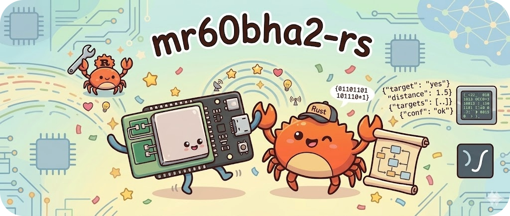
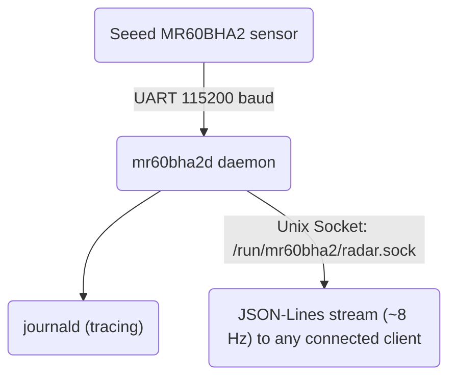

<p align="center">
  
  <br><br>
  <strong>A lean Rust microservice for the Seeed MR60BHA2 60 GHz mmWave radar sensor on Linux.</strong>
  <br><br>
  
  
  
</p>

---

> [!Note]
This project talks **directly** to the bare MR60BHA2 radar module over UART — either via the Raspberry Pi's GPIO serial port or through a USB-to-TTL adapter on any Linux PC. No XIAO ESP32C6 or ESPHome stack required. (The Seeed kit ships with a XIAO running ESPHome as a Wi-Fi bridge; this daemon replaces that entire stack with a single native binary.)

The daemon reads the sensor over UART and streams aggregated sensor data as JSON-Lines over a Unix domain socket. The protocol library is `no_std`-compatible.

## Architecture



The MR60BHA2 emits several different frame types at ~8 Hz (targets, vitals, presence). The daemon aggregates them into a unified snapshot emitted on a configurable timer.

## Crates

| Crate | Description | |
|---|---|---|
| `mr60bha2-proto` | Protocol library: zero-alloc frame parser (state machine). `no_std`-compatible. | [](https://crates.io/crates/mr60bha2-proto) [](https://docs.rs/mr60bha2-proto) |
| `mr60bha2d` | Streaming daemon: reads UART, aggregates frames, broadcasts JSON over Unix socket. | |

## Sensor Data Format

The daemon emits one JSON line per snapshot (~8 Hz). Uses SI units throughout.

```json
{
  "ts": 1744489123.456,
  "targets": [
    {
      "x": 0.42,
      "y": 1.71,
      "speed": -0.17,
      "dist": 1.76,
      "angle": 13.8
    }
  ],
  "vitals": {
    "heart_rate": 72.0,
    "breath_rate": 16.0,
    "heart_phase": 0.31,
    "breath_phase": 1.02
  },
  "presence": true
}
```

| Field | Unit | Description |
|---|---|---|
| `ts` | seconds (Unix) | Timestamp |
| `x` | metres | Horizontal position (+ right, − left of sensor) |
| `y` | metres | Distance in front of sensor (always positive) |
| `speed` | m/s | Radial speed (+ approaching, − receding) |
| `dist` | metres | Euclidean distance from sensor |
| `angle` | degrees | Angle from boresight |
| `vitals.heart_rate` | bpm | Heart rate |
| `vitals.breath_rate` | bpm | Breathing rate |
| `vitals.heart_phase` | rad | Heart waveform phase |
| `vitals.breath_phase` | rad | Breathing waveform phase |
| `presence` | bool | Human presence detected |

`vitals` is omitted until the sensor emits at least one vitals frame. Up to **3 targets** can be tracked simultaneously.

> **Vitals vs. targets — important distinction**
>
> The sensor has two independent operating modes that run in parallel:
>
> | Capability | Range | What you get |
> |---|---|---|
> | **Target tracking** | up to 6 m | Position (x/y), speed, and presence for up to 3 people |
> | **Vital signs** (heart rate, breathing) | ≤ 1.5 m | One global measurement — **not** per-target |
>
> Vitals are designed for **a single stationary person** (the manufacturer recommends sleep scenarios only). The sensor does not attribute vitals to individual targets — it simply reports one heart rate and one breath rate for whoever is closest. When vitals mode is active (person within 1.5 m), presence-detection sensitivity may decrease.

## Quick Start

### Requirements

- Rust 1.74+ (or install via [rustup](https://rustup.rs/))
- A serial port connected to a Seeed MR60BHA2 sensor (direct UART — no XIAO needed)
- Linux (any architecture; tested on x86_64 and aarch64)
- Sensor firmware **v1.6.12** or later recommended (fixes target tracking within 1.5 m).
  See the [Seeed wiki](https://wiki.seeedstudio.com/getting_started_with_mr60bha2_mmwave_kit/#module-firmware-upgrade) for upgrade instructions.

### Build

```bash
cargo build --release
```

### Configuration

The daemon works out of the box with sensible defaults. A config file is **optional** —
if none is found, the following defaults are used:

| Setting | Default |
|---|---|
| `device` | `/dev/ttyAMA0` |
| `baud_rate` | `115200` |
| `socket_path` | `/run/mr60bha2/radar.sock` |
| `window_ms` | `125` |
| `log_level` | `info` |

To override any setting, create a TOML config file:

```toml
device = "/dev/ttyUSB0"
baud_rate = 115200
socket_path = "/run/mr60bha2/radar.sock"
window_ms = 125
log_level = "info"
```

Common serial device paths:

- `/dev/ttyAMA0` — Raspberry Pi GPIO UART
- `/dev/ttyUSB0` — USB-to-serial adapters
- `/dev/ttyACM0` — CDC ACM devices (e.g. XIAO ESP32C6 bridge)

### Run

```bash
# Run with defaults (no config file needed)
mr60bha2d

# Run with explicit config
mr60bha2d /path/to/config.toml

# Override log level via environment
RUST_LOG=debug mr60bha2d
```

Connect a client to read the stream:

```bash
socat - UNIX-CONNECT:/run/mr60bha2/radar.sock
```

## Deployment

### Cross-Compilation

```bash
# Install cross (Docker-based cross-compiler)
cargo install cross

# Build for aarch64
cross build --target aarch64-unknown-linux-gnu --release
```

Or use the provided [justfile](https://github.com/casey/just):

```bash
just build                                    # default: aarch64-unknown-linux-gnu
TARGET=x86_64-unknown-linux-gnu just build    # override target
```

### Pre-built Binaries

Pre-built binaries for x86_64 and aarch64 Linux are available on the
[Releases](https://github.com/duramson/mr60bha2-rs/releases) page.

### systemd

Copy the provided unit files to the target system:

```bash
cp deploy/mr60bha2d.service /etc/systemd/system/
cp deploy/mr60bha2d.tmpfiles /etc/tmpfiles.d/mr60bha2d.conf

# Create runtime directory
systemd-tmpfiles --create

# Edit the service to match your serial device if needed
# Default: /dev/ttyAMA0
systemctl edit mr60bha2d

# Enable and start
systemctl daemon-reload
systemctl enable --now mr60bha2d
```

The service unit includes security hardening (ProtectSystem, NoNewPrivileges, PrivateTmp, etc.).

### Automated Deployment

```bash
# Deploy to a remote host (requires just + cross)
DEPLOY_HOST=user@hostname just deploy
```

## Consuming the Stream

Any process can connect to the Unix socket and receive the JSON-Lines stream:

```bash
# Live output
socat - UNIX-CONNECT:/run/mr60bha2/radar.sock

# Pretty-print with jq
socat - UNIX-CONNECT:/run/mr60bha2/radar.sock | jq .
```

```python
# Python example
import socket, json

sock = socket.socket(socket.AF_UNIX, socket.SOCK_STREAM)
sock.connect("/run/mr60bha2/radar.sock")
for line in sock.makefile():
    snapshot = json.loads(line)
    print(snapshot["targets"], snapshot.get("vitals"), snapshot["presence"])
```

The JSON format is compatible with [radar-dash](https://github.com/duramson/radar-dash) — a sensor-agnostic web frontend that works with any daemon emitting this schema.

## Related Projects

| Project | Description |
|---|---|
| [radar-dash](https://github.com/duramson/radar-dash) | Sensor-agnostic HTML5 radar visualisation dashboard. Works directly with `mr60bha2d` over WebSocket. |
| [ld2450-rs](https://github.com/duramson/ld2450-rs) | Equivalent daemon for the HLK-LD2450 24 GHz sensor — same JSON schema, position + Doppler without vital signs. |

## Wiring

The MR60BHA2 uses a 5-pin connector. UART pins operate at **3.3V TTL** level.

| Sensor Pin | Connection |
|---|---|
| 5V | 5V power supply |
| GND | Ground |
| TX | UART RX on your host |
| RX | UART TX on your host |
| IO | (optional, interrupt output) |

**Raspberry Pi GPIO example** (3.3V UART — direct connection, no level shifter needed):

| Sensor Pin | Pi Pin |
|---|---|
| TX | Pin 10 (GPIO15 / UART RX) |
| RX | Pin 8 (GPIO14 / UART TX) |

If using a Raspberry Pi, disable Bluetooth to free the primary UART:

```bash
# /boot/firmware/config.txt (or /boot/config.txt on older systems)
enable_uart=1
dtoverlay=disable-bt
```

## Sensor Specs

| Parameter | Value |
|---|---|
| Frequency | 60 GHz ISM band |
| Max detection range | 3 m |
| Detection angle | ±60° azimuth |
| Max targets | 3 simultaneous |
| Data rate | ~8 Hz |
| Interface | UART (3.3V TTL), 115200 baud 8N1 |
| Supply voltage | 5V DC |
| Extra features | Heart rate, breathing rate, presence detection |

## License

Licensed under either of

- [Apache License, Version 2.0](LICENSE-APACHE)
- [MIT License](LICENSE-MIT)

at your option.

### Contribution

Unless you explicitly state otherwise, any contribution intentionally submitted
for inclusion in the work by you, as defined in the Apache-2.0 license, shall be
dual licensed as above, without any additional terms or conditions.
